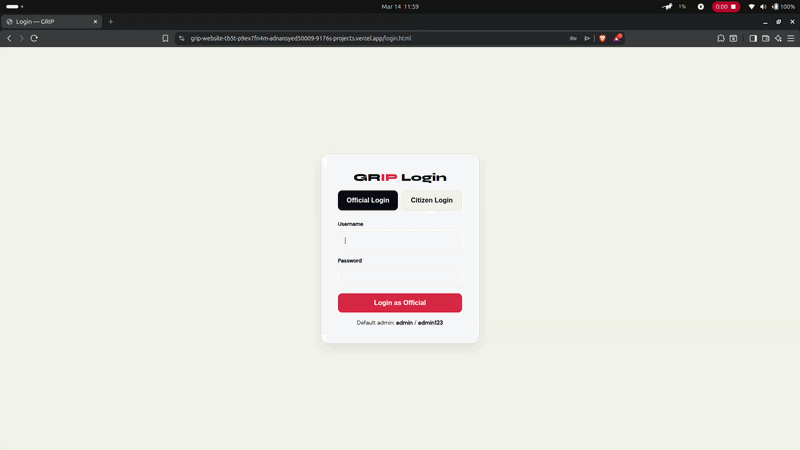
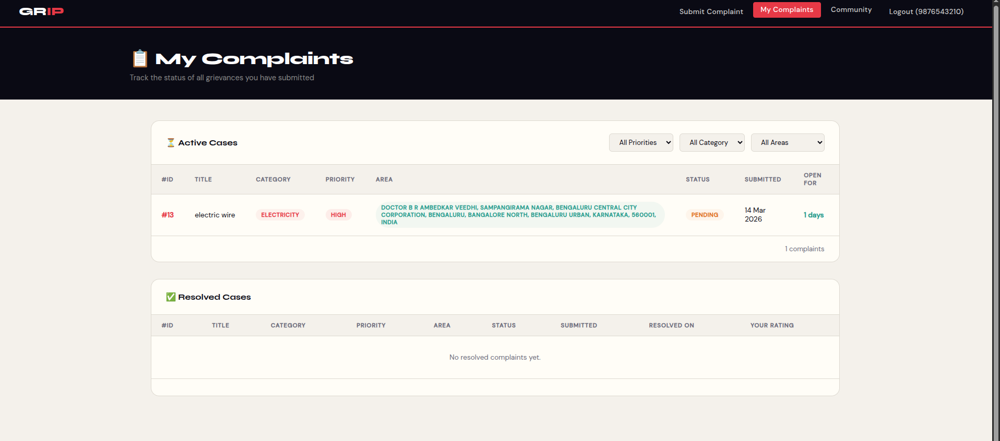
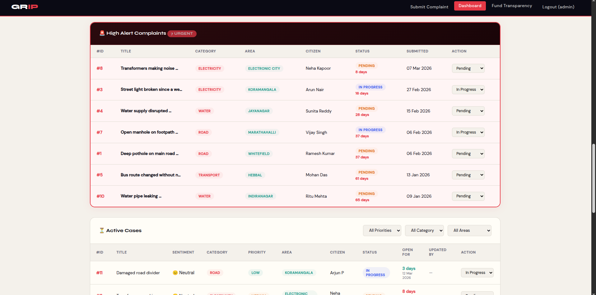

# 🌍 GRIP

## Public Grievance Intelligence & Resolution Platform


[](https://grip-website.vercel.app)

---

## 🌟 Overview

**GRIP (Public Grievance Intelligence & Resolution Platform)** is an **AI-powered civic grievance management system** that enables citizens to report public issues and helps authorities resolve them efficiently using intelligent categorization, real-time tracking, and geo-spatial analytics.

The platform bridges the gap between **citizens and government authorities** by providing a transparent, digital, and data-driven system for managing civic complaints.

---

# 🚨 Problem Statement

Citizens often face difficulties reporting civic problems such as:

* 🛣️ Potholes
* 🗑️ Garbage overflow
* 💧 Water leakage
* ⚡ Electricity problems

Most existing grievance systems are **manual, slow, and lack transparency**.

### Major Issues

❌ No centralized reporting platform
❌ Manual complaint categorization
❌ No real-time complaint tracking
❌ Limited communication between citizens and authorities
❌ Lack of analytics for identifying recurring issues

These limitations lead to **delayed resolutions and reduced public trust**.

---

# 💡 Proposed Solution

GRIP introduces an **AI-powered digital grievance platform** that simplifies complaint submission and enables authorities to manage issues efficiently.

### Key Capabilities

✔ AI-powered complaint categorization
✔ Real-time complaint tracking
✔ Geo-tagged issue reporting
✔ Intelligent admin dashboards
✔ Secure OTP-based login

The platform significantly improves **efficiency, transparency, and citizen engagement**.

---

# ✨ Key Features

## 👥 Citizen Portal

* Submit complaints through an easy interface
* Upload images with location information
* Track complaint progress in real time
* Receive notifications when issues are resolved

---

## 📊 Admin Intelligence Dashboard

* View all complaints in one place
* Assign complaints to departments
* Monitor progress of issue resolution
* View analytics and system insights

---

## 🤖 AI-Based Complaint Categorization

The platform automatically categorizes complaints into areas like:

* Road Issues
* Electricity Problems
* Water Supply
* Garbage Management
* Transport Issues

This reduces **manual work and speeds up complaint processing**.

---

## ⚡ Real-Time Complaint Updates

Using **Socket.IO**, the system pushes **instant updates to the admin dashboard** whenever a new complaint is submitted.

---

## 🗺 Geo-Spatial Complaint Mapping

GRIP integrates mapping tools to visualize civic problems geographically.

Technologies used:

* OpenStreetMap
* Leaflet.js

This enables **heatmaps of complaint hotspots across the city**.

---

## 🔐 Secure Authentication

Security is handled using:

* OTP verification via **Twilio API**
* **JWT authentication** for session management

---

## 📷 Photo Evidence Upload

Citizens can attach **photos of civic issues**, helping authorities understand problems more quickly.

---

## 📜 Audit Logging

Every important action is recorded:

* User login
* Complaint updates
* Staff assignments

This improves **accountability and transparency**.

---

# 🏗 System Architecture

Below is the high-level architecture of the GRIP platform.

```
Citizen / User
      │
      ▼
Frontend (HTML, CSS, JavaScript)
      │
      ▼
Flask Backend (API Server)
      │
 ┌────┴────┐
 ▼         ▼
SQLite   AI Categorization
Database   Engine
      │
      ▼
External Services
 └ OpenStreetMap + Leaflet
```

---

# 🎬 Demo





# 📂 Project Structure

```
grip-website
│
└── grievance-platform
    │
    ├── templates
    │   ├── index.html
    │   ├── dashboard.html
    │   ├── login.html
    │   └── complaint_form.html
    │
    ├── app.py
    ├── check_db.py
    ├── check_users.py
    ├── requirements.txt
    └── vercel.json
```

### File Description

| File               | Purpose                             |
| ------------------ | ----------------------------------- |
| `app.py`           | Main Flask backend server           |
| `templates/`       | Frontend HTML pages                 |
| `check_db.py`      | Database debugging script           |
| `check_users.py`   | Utility for inspecting users        |
| `requirements.txt` | Project dependencies                |
| `vercel.json`      | Vercel serverless deployment config |

---

# ⚙ Installation & Setup

## Clone the Repository

```bash
git clone https://github.com/syed-adnan-01/grip-website.git
cd grip-website/grievance-platform
```

---

## Create Virtual Environment

Linux / Mac

```bash
python3 -m venv venv
source venv/bin/activate
```

Windows

```bash
python -m venv venv
venv\Scripts\activate
```

---

## Install Dependencies

```bash
pip install -r requirements.txt
```

---

## Run the Server

```bash
python app.py
```

Open the application:

```
http://localhost:5000
```

---

# ☁ Deployment

GRIP supports **serverless deployment using Vercel**.

### Steps

Install Vercel CLI

```
npm install -g vercel
```

Login

```
vercel login
```

Deploy

```
vercel
```

---

# 🔗 API Endpoints


## Complaints

| Method | Endpoint            | Description             |
| ------ | ------------------- | ----------------------- |
| POST   | `/submit-complaint` | Submit complaint        |
| GET    | `/complaints`       | Get all complaints      |
| GET    | `/complaint/<id>`   | Get complaint details   |
| PUT    | `/update-status`    | Update complaint status |

---

## Admin

| Method | Endpoint           | Description               |
| ------ | ------------------ | ------------------------- |
| GET    | `/admin/dashboard` | Dashboard statistics      |
| POST   | `/assign-staff`    | Assign complaint to staff |

---

# 📷 Screenshots






---

# 📈 Business Value

GRIP enables:

🏙 **Smart city digital infrastructure**
📊 **Data-driven urban planning**
⚡ **Faster grievance resolution**
🤝 **Improved citizen-government interaction**

The platform can be scaled across **multiple cities and municipalities**.

---

# 🚀 Future Enhancements

* Mobile application for citizens
* AI-based issue severity detection
* Automated complaint escalation
* Integration with government systems
* Advanced analytics dashboards

---

# 🤝 Contributing

Contributions are welcome.

1. Fork the repository
2. Create a branch

```
git checkout -b feature-name
```

3. Commit changes

```
git commit -m "Added new feature"
```

4. Push changes

```
git push origin feature-name
```

5. Create a Pull Request

---

# 📜 License

This project is licensed under the **MIT License**.

---

# 👨‍💻 Author

**Team Quadra Nova**
Computer Science & Engineering Student

GitHub
[https://github.com/syed-adnan-01](https://github.com/syed-adnan-01)
